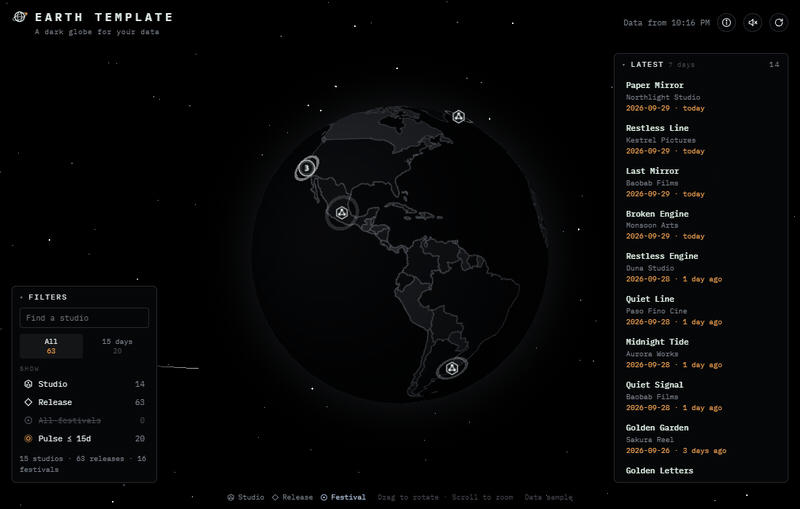
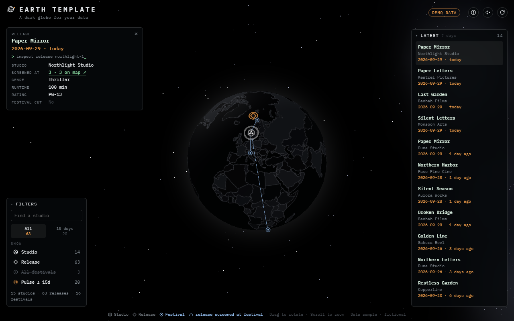
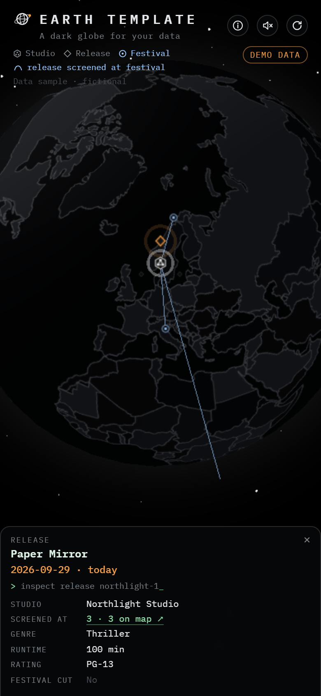

# Earth Template

**A dark globe, a starry sky, and cards. Bring your own data.**



Earth Template is a ready-made interactive Earth for a data set where things sit on a map and connect to each other. It was extracted from Modex, an app that shows the AI model catalog on a globe. The look and feel are done. You supply the data and the wording.

The demo data is entirely fictional: film studios, their releases, and the festivals that screened them. The places are real cities, used only as map positions, and the links (so the arcs) are random. The app shows a "Demo data" badge until you set `demo: false` in `src/config.ts`.

## What's included

- **The globe.** Dark country tiles with a soft rim of light. Drag to spin, scroll to zoom. Nearby pins group into numbered badges, and one click fans a badge out.
- **Space.** A faint Milky Way, stars, distant shooting stars, a few drifting asteroids, and satellites circling the globe.
- **Cards.** Select something and a card opens with rows taken straight from your data. Selecting an item draws arcs to everything it links to, and the legend names what an arc means ("release screened at festival"). You set that wording in `config.link`.
- **Panels.** Filters and search, a Latest list, an About panel, and a legend that is always on screen.
- **Sound.** Optional synthesized cues (nothing to download), off until the visitor turns them on.
- **Phones.** The card becomes a bottom sheet, and the side panels fold away.
- **Offline.** The last data is saved in the browser, so return visits open at once.
- **Light.** About 60 fps in testing. It stops drawing when the tab is hidden and calms down for people who ask for reduced motion.

<table>
  <tr>
    <td width="70%"></td>
    <td width="30%" align="center"></td>
  </tr>
</table>

## Quick start

You'll need Node.js 22 (20.19 or newer also works).

```bash
npm install
```
```bash
npm run dev
```

Open the address Vite prints, usually <http://localhost:5173>.

## Make it your own

1. **Name and wording.** Edit [`src/config.ts`](src/config.ts): the app name, the tagline, what the three kinds are called, the About text, and how much of the sky to draw.
2. **Data.** Replace the body of [`data/build.ts`](data/build.ts) so it returns your data. The shape is in [`src/data.ts`](src/data.ts) and is only a few lines.
3. **Look.** Colours are in [`src/theme.ts`](src/theme.ts) (the 3D scene) and at the top of [`src/style.css`](src/style.css) (the page). Marker shapes are in [`src/icons.ts`](src/icons.ts).
4. **Media and notices.** `npm run media` recaptures the screenshots and GIF above from your build. `npm run notices` rebuilds the third-party notices.

[docs/CUSTOMIZING.md](docs/CUSTOMIZING.md) covers each of these in detail, with examples.

## The three kinds

Everything on the globe is one of three kinds, so any data with this shape fits:

| Kind | On the globe | Demo data | Modex |
| --- | --- | --- | --- |
| **hub** | A pin on the map. Its items fan out around it when selected. | Studio | Lab |
| **item** | Belongs to a hub. Not a place, so it rings its hub. | Release | Model |
| **node** | A pin elsewhere, linked to items by arcs. | Festival | Provider |

Other fits: airlines, routes, and airports; museums, exhibitions, and lenders; labs, papers, and universities.

## Project layout

```
index.html              page structure
src/config.ts           names, wording, effects   ← start here
src/data.ts             the shape of your data, and loading it
src/app.ts              selection, cards, panels, layout
src/globe.ts            the 3D globe, markers, clustering, arcs
src/space.ts            the sky, shooting stars, asteroids, satellites, rim glow
src/sound.ts            the sound cues
src/icons.ts, theme.ts  marker shapes and colours
data/build.ts           where your data comes from   ← and here
data/sample.ts          the demo data
```

## Deploy

`npm run build` writes a plain folder, `dist/`, that any static host can serve. The build runs `data/build.ts` once and saves the result as `dist/data.json`, so there is no server to run. Rebuild whenever your data changes, or on a schedule (see [docs/CUSTOMIZING.md](docs/CUSTOMIZING.md#keeping-data-fresh)).

[`public/_headers`](public/_headers) sets strict security headers (Cloudflare Pages and Netlify read it). On other hosts, set the same headers in that host's config.

## License

Copyright (C) 2026 earth-template.

Earth Template is free software under the [GNU Affero General Public License v3.0](LICENSE) (AGPL-3.0). You can use, study, change, and share it. If you run a modified version for others, including as a website, you need to share your changes under the same license. It comes with no warranty: the authors aren't liable for how it's used.

It bundles three.js (MIT), d3-geo, d3-array, topojson-client and world-atlas (ISC), the IBM Plex Mono font (SIL Open Font License), and Natural Earth map data (public domain). Their notices are in [public/third-party-notices.txt](public/third-party-notices.txt), which ships with the site.
